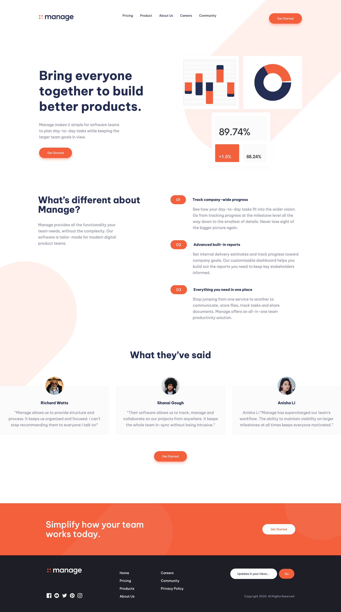

Solution to an Intermediate level project from [Frontend Mentor Website](https://www.frontendmentor.io/challenges/manage-landing-page-SLXqC6P5)

- Live Site URL: [Manage Apps](https://manage-apps.netlify.app/)

Tech Stack:

- Semantic HTML5 markup
- CSS custom animations
- TailwindCss
- JavaScript
- SwiperJS
- Flexbox
- Mobile-first workflow
- Email Verification with Regex

Designs are optimized for:

- Mobile: 375px
- Desktop: 1440px

## Colors

Bright Red: hsl(12, 88%, 59%)
Dark Blue: hsl(228, 39%, 23%)
Dark Grayish Blue: hsl(227, 12%, 61%)
Very Dark Blue: hsl(233, 12%, 13%)
Very Pale Red: hsl(13, 100%, 96%)
Vary Light Gray: hsl(0, 0%, 98%)

## Typography

- Family: [Be Vietnam Pro](https://fonts.google.com/specimen/Be+Vietnam+Pro)
- Weights: 400, 500, 700# Manage-Landing-Page
